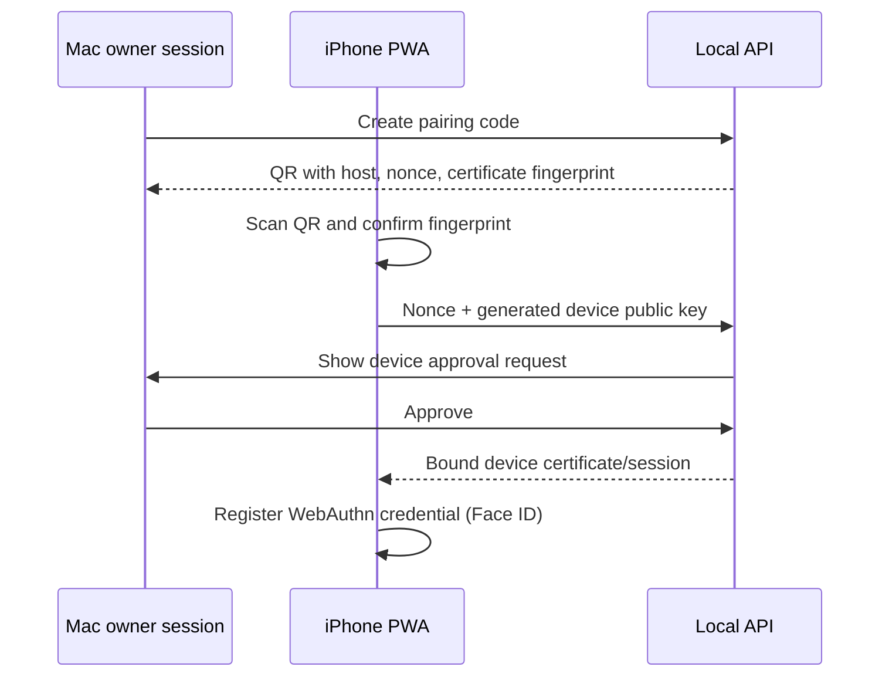

# API and sync architecture

## 1. Contract approach

The Mac exposes a versioned local HTTPS API under `/api/v1`. Zod schemas are the
source for runtime validation and generated OpenAPI documentation. The PWA consumes
a generated TypeScript client; hand-written fetch calls are not allowed in features.

API errors follow one shape:

```json
{
  "error": {
    "code": "VERSION_CONFLICT",
    "message": "The transaction changed on another device.",
    "correlationId": "...",
    "details": {}
  }
}
```

## 2. Command and query endpoints

This is the initial surface, not an exhaustive OpenAPI specification.

### Identity and devices

| Method | Path | Purpose |
| --- | --- | --- |
| `GET` | `/auth/google/start` | Begin owner OAuth on Mac |
| `GET` | `/auth/google/callback` | Complete OAuth and establish owner session |
| `POST` | `/devices/pairing-codes` | Create short-lived pairing QR payload |
| `POST` | `/devices/pair` | Exchange pairing proof and device public key |
| `POST` | `/sessions/refresh` | Rotate a paired-device session |
| `DELETE` | `/devices/:id` | Revoke device and sessions |

### Ledger and dashboard

| Method | Path | Purpose |
| --- | --- | --- |
| `GET` | `/dashboard?month=` | Dashboard read model |
| `GET` | `/ledger` | Cursor-paginated filtered transactions |
| `POST` | `/transactions` | Create draft or posted manual transaction |
| `PATCH` | `/transactions/:id` | Edit draft using expected version |
| `POST` | `/transactions/:id/reverse` | Reverse posted transaction |
| `POST` | `/transactions/:id/replace` | Correct by reversal plus replacement |
| `POST` | `/transactions/bulk-classify` | Apply category and optionally create rule |
| `POST` | `/reconciliations` | Start/complete account reconciliation |

### Review and imports

| Method | Path | Purpose |
| --- | --- | --- |
| `POST` | `/sync-runs` | Trigger selected Gmail/SMS/file discovery |
| `GET` | `/sync-runs/:id` | Stream/poll progress and counts |
| `POST` | `/statement-uploads` | Begin resumable local upload |
| `GET` | `/candidates` | Filtered review queue |
| `PATCH` | `/candidates/:id` | Edit candidate hypothesis |
| `POST` | `/candidate-actions/approve` | Approve one or many atomically per group |
| `POST` | `/candidate-actions/reject` | Reject with reason |
| `POST` | `/candidate-actions/merge` | Merge evidence into one candidate group |
| `POST` | `/candidate-actions/split` | Split one candidate into several |

### Planning and trackers

| Method | Path | Purpose |
| --- | --- | --- |
| `GET/PUT` | `/budgets/:month` | Read/update monthly budget |
| `POST` | `/months/:month/close` | Close month and record surplus decision |
| `GET` | `/debts` | Debt table and authoritative/projected balances |
| `POST` | `/debt-scenarios` | Calculate snowball or custom payoff |
| `GET/POST` | `/goals` | Goal management |
| `POST` | `/goal-scenarios` | Calculate required contribution/completion |
| `GET/POST` | `/projects` | Project management |
| `GET` | `/projects/:id/summary` | Construction/project read model |
| `GET/POST` | `/obligations` | People ledger |
| `POST` | `/forecasts` | Generate versioned twelve-month forecast |

### Operations

| Method | Path | Purpose |
| --- | --- | --- |
| `GET` | `/health` | Non-sensitive liveness |
| `GET` | `/system/status` | Authenticated data, backup, parser, job health |
| `POST` | `/backups` | Run an on-demand verified snapshot |
| `POST` | `/backups/:id/verify` | Restore-check a snapshot in isolation |
| `GET` | `/audit-events` | Search audit trail |

## 3. Mutation envelope

All mutating requests include:

```json
{
  "meta": {
    "idempotencyKey": "device-uuid:local-sequence",
    "deviceId": "...",
    "expectedVersion": 12,
    "clientCreatedAt": "2026-07-18T10:30:00.000Z"
  },
  "data": {}
}
```

The server stores the request hash and result. Reusing a key with a different body
is rejected. Reusing it with the same body returns the original result.

## 4. Offline data model

IndexedDB contains:

- bounded normalized copies of accounts, categories, months, current budgets,
  recent transactions, dashboard read models, goals, debts, and projects;
- an encrypted mutation outbox;
- the last applied server sequence;
- pending SMS Shortcut payloads;
- local drafts and minimal attachment thumbnails.

OAuth refresh tokens, Gmail content, complete statements, permanent attachments,
database keys, and backup keys never enter browser storage.

## 5. Incremental sync protocol

### Push phase

1. PWA sends ordered outbox mutations with idempotency key and expected version.
2. Server validates authentication, device status, schema, and domain invariant.
3. Server commits accepted mutation, audit event, and `sync_changes` row atomically.
4. Client marks accepted items delivered; rejected items remain with actionable error.

### Pull phase

1. Client requests `/sync/changes?after=<serverSequence>&limit=<n>`.
2. Server returns ordered changes and `highWatermark` captured at request start.
3. Client applies the page in one IndexedDB transaction.
4. Client advances its cursor only after commit.
5. Paging continues until the high watermark is reached.

Tombstones are retained long enough for rarely used paired devices. A device behind
the retention boundary performs a new bounded snapshot sync.

## 6. Conflict policy

| Conflict | Resolution |
| --- | --- |
| Same idempotency key retried | Return original result |
| Different records edited | Both succeed |
| Draft edited at stale version | Field-aware merge if disjoint; otherwise user choice |
| Posted transaction edited | Reject; use correction workflow |
| Candidate approved elsewhere | Return canonical transaction and remove local action |
| Category deleted while offline | Map to uncategorized and request review |
| Goal allocation exceeds current funds | Reject with updated available amount |
| Month closed while edit queued | Reopen permission/review required |

Financial conflicts are never silently resolved with last-write-wins.

## 7. Device pairing



The pairing nonce expires after five minutes and is single-use. Pairing requires an
already authenticated Mac session and physical access to both devices. PIN fallback
unlocks the app session; it does not replace device cryptographic identity.

## 8. Local HTTPS discovery

The setup command registers a stable Bonjour name such as `finance-hero.local`,
generates a local CA/server certificate, and guides installation of the CA on the
iPhone. The QR includes the expected certificate fingerprint to reduce local
network impersonation risk.

If `.local` resolution fails, the app advertises current private IP addresses and
regenerates a certificate with those SANs. Certificate rotation preserves the CA
and requires explicit device acknowledgement.

## 9. SMS Shortcut endpoint

`POST /api/v1/import-hooks/ios-message` accepts a paired-device signed payload:

```json
{
  "messageId": "shortcut-generated-stable-id",
  "receivedAt": "2026-07-18T08:15:00+05:30",
  "sender": "VK-HDFCBK",
  "body": "...",
  "deviceId": "...",
  "signature": "..."
}
```

The PWA/Shortcut keeps the payload locally when the Mac is unavailable. The endpoint
returns discovery status only; the message still requires review before posting.

## 10. Pagination and exports

- Ledger endpoints use stable `(occurred_on, id)` cursors, never offset pagination.
- Large exports are jobs that create encrypted local files with an expiry.
- CSV exports escape spreadsheet formulas and redact account numbers by default.
- Backup/restore is separate from user-facing export and includes all evidence.
