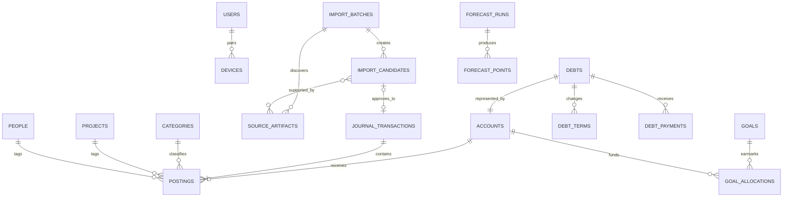

# Data architecture

## 1. Ledger model

Finance Hero uses a journal-and-postings model. A financial event is one
`journal_transaction` containing two or more signed `postings`. For every posted
transaction:

```text
sum(posting.amount_paise) = 0
```

This invariant prevents transfers and card payments from being counted twice and
supports split categories without special-case arithmetic.

Amounts are signed 64-bit integers in paise. Dates are stored separately as:

- `occurred_on`: local financial date (`YYYY-MM-DD`);
- `occurred_at`: optional source timestamp with offset;
- `recorded_at`: UTC audit timestamp;
- `effective_month`: explicit budget month when it differs from the source date.

Floating-point money is prohibited in domain and persistence code.

## 2. Account classification

| Class | Examples | Normal balance |
| --- | --- | --- |
| Asset | bank, cash, Pluxee, receivable, investment, property | Debit/positive |
| Liability | credit card, bank loan, personal payable | Credit/negative |
| Income | salary, interest, benefit, reimbursement income | Credit/negative |
| Expense | groceries, rent, interest, fees, medical | Debit/positive |
| Equity | opening balance, retained surplus, migration variance | Credit/negative |

User-facing balances normalize signs by account class. The storage invariant remains
consistent and does not change to match display conventions.

## 3. Example journal entries

### Credit-card grocery purchase of Rs 1,250

| Posting | Account | Amount |
| --- | --- | ---: |
| Grocery expense | `expense:groceries` | +125000 |
| Card liability | `liability:icici-card` | -125000 |

### Card payment of Rs 10,000

| Posting | Account | Amount |
| --- | --- | ---: |
| Card liability | `liability:icici-card` | +1000000 |
| Bank account | `asset:salary-bank` | -1000000 |

### Loan EMI of Rs 10,381 split into principal and interest

| Posting | Account | Amount |
| --- | --- | ---: |
| Loan liability principal reduction | `liability:personal-loan` | +790000 |
| Interest expense | `expense:loan-interest` | +248100 |
| Bank account | `asset:salary-bank` | -1038100 |

### Allocate Rs 20,000 of existing savings to an emergency goal

No journal transaction is created. A goal allocation links Rs 20,000 of the
existing savings-account balance to the goal.

## 4. Primary entities

Identifiers are UUIDv7. Mutable aggregate roots carry an integer `version` for
optimistic concurrency. All tables include UTC `created_at` and `updated_at` unless
noted otherwise.

### Identity and devices

- `users`: Google subject, email, display name, status, last login.
- `devices`: owner, public key, name, platform, paired/revoked timestamps, last sync.
- `sessions`: hashed session token, device, expiry, assurance level.
- `webauthn_credentials`: public credential data only; no biometric data is stored.

### Ledger

- `accounts`: name, account class/type, institution, masked number, active state,
  restricted-wallet flag, opening date, statement currency fixed to INR.
- `journal_transactions`: date/time, payee, memo, status, origin, effective month,
  reconciliation state, superseded/reversal links, version.
- `postings`: transaction, account, amount paise, category, project, person, debt,
  goal-purpose metadata, cleared state.
- `categories`: hierarchical code, name, broad bucket, expense classification,
  budget eligibility, alert eligibility.
- `merchants`: normalized name and aliases.
- `attachments`: encrypted object key, hash, MIME, size, original name, scan state.
- `transaction_attachments`: transaction/evidence association.
- `reconciliations`: account, statement period, opening/closing balance, difference,
  completed timestamp.

Transaction status is `draft`, `posted`, `voided`, or `reversed`. Posted transaction
postings are immutable; corrections create a reversal and replacement linked to the
original. Drafts can be edited in place.

### Import and review

- `import_connections`: Gmail or SMS endpoint configuration and health; secrets are
  referenced from Keychain rather than stored directly.
- `import_batches`: source, requested range, cursor, state, counts, parser version.
- `source_artifacts`: Gmail message, SMS payload, statement file, or workbook row;
  encrypted/raw location, content hash, source identifier, retention state.
- `import_candidates`: extracted transaction hypothesis, normalized values,
  confidence, status, duplicate group, revision.
- `candidate_sources`: many-to-many evidence links with source field provenance.
- `candidate_matches`: match score, features, proposed action, reviewer decision.
- `classification_rules`: priority, conditions, action, source, effective dates.
- `classification_feedback`: before/after values used to improve future suggestions.

Candidate status is `discovered`, `parsed`, `needs_review`, `approved`, `rejected`,
`failed`, or `superseded`. Approval and journal creation occur in one database
transaction.

### Budget and recurring activity

- `budget_periods`: month, state, income plan, notes, closed timestamp.
- `budget_lines`: category/broad bucket, planned paise, rollover policy, alert policy.
- `recurring_rules`: cadence, amount strategy, expected account/category/payee,
  next due date, confidence, source.
- `month_closes`: calculated totals, surplus allocation decision, snapshot hash.

### Debt and EMI

- `debts`: liability account, lender, product type, original amount, current
  statement principal, status, priority override.
- `debt_terms`: effective date, annual rate in basis points, EMI paise, due day,
  remaining tenure, fees, statement source.
- `debt_payments`: linked journal transaction, principal, interest, fee, prepayment.
- `debt_scenarios`: strategy, assumptions, extra payment, ordered debts, result hash.
- `debt_schedule_rows`: scenario output by month; derived and safely regenerable.

The latest reconciled statement principal wins over the projected balance. A
variance remains visible and causes future schedule regeneration.

### Savings, assets, investments, and goals

- `assets`: asset account, subtype, owner, acquisition and liquidity metadata.
- `holdings`: asset, instrument identifier, units as fixed decimal, cost basis.
- `valuations`: asset/holding, date, value paise, source, confidence.
- `goals`: target paise/date, priority, state, strategy, notes.
- `goal_allocations`: goal, asset account, allocated paise, effective date.
- `goal_scenarios`: contribution assumptions and completion projection.

For every asset account and effective date, total active goal allocations may not
exceed the available account balance unless the user explicitly records a planned,
not-current allocation. Planned allocations are excluded from current savings.

### Projects and people

- `projects`: name, type, status, start/target dates, budget, forecast, freshness state.
- `project_phases`: project, order, estimate, state, dates.
- `vendors`: identity and contact fields.
- `project_commitments`: vendor/phase, estimate, committed value, due date, status.
- `project_milestones`: due date, state, notes.
- `people`: display/contact data.
- `obligations`: person, direction (`receivable` or `payable`), principal, due date,
  state, linked journal transaction.
- `obligation_settlements`: obligation, journal transaction, amount.

Project actuals come from postings linked to the project. Stored summary values are
caches only and must be recomputable.

### Forecasting, notifications, and operations

- `forecast_runs`: horizon, input cutoff, engine version, assumptions, state.
- `forecast_points`: run, metric, month/date, expected/low/high paise, explanation.
- `notification_events`: type, trigger facts, channel state, acknowledged timestamp.
- `jobs`: kind, payload, schedule, lease, attempts, idempotency key, state.
- `audit_events`: actor/device, action, entity, before/after patch, reason, timestamp.
- `sync_changes`: monotonically increasing server sequence, entity, operation, version.
- `idempotency_keys`: device/request key, request hash, stored response, expiry.

## 5. Relationship overview



## 6. Derived projections

Read models are updated transactionally or rebuilt from the ledger:

- monthly category spend;
- account current balance;
- card utilization and debt totals;
- budget progress and danger-alert eligibility;
- project paid/pending totals;
- person obligation balance;
- goal funded amount;
- net worth history.

Derived records include `calculated_through_sequence`. A stale read model can be
detected and rebuilt; it is never treated as stronger evidence than journal data.

## 7. Critical invariants

1. Posted transactions balance exactly to zero paise.
2. Posted postings are immutable; correction is reversal plus replacement.
3. Approval creates at most one canonical transaction per candidate group.
4. Source identifiers and content hashes are unique within a source connection.
5. A credit-card payment cannot carry an expense-category posting.
6. Own-account transfers cannot post to income or expense accounts.
7. Goal allocations do not alter ledger balances.
8. Derived totals declare the server sequence through which they are complete.
9. Every offline mutation has an idempotency key and expected aggregate version.
10. Historical aggregate migration records are visibly marked and cannot masquerade
    as detailed source transactions.

## 8. Data retention

- Ledger, audit, migration, and reconciliation records: retained indefinitely.
- Approved candidate metadata and source references: retained indefinitely unless
  the user explicitly redacts raw content.
- Raw Gmail/SMS body and statement working files: configurable; default 90 days
  after successful reconciliation.
- Original statement attachments selected for permanent evidence: retained indefinitely.
- Failed/quarantined uploads: 30 days by default.
- Logs: 30 days, with sensitive fields redacted.
- Idempotency response bodies: 30 days; durable source uniqueness remains afterward.

Retention cleanup itself is audited and never deletes canonical ledger entries.
