# Import and classification pipeline

## 1. Design objective

Imports reduce typing while preserving user control. Every source follows the same
pipeline and produces reviewable candidates. Parsers do not write directly to the
ledger.

```mermaid
flowchart LR
    SOURCE["Gmail, SMS, PDF, CSV, XLSX, manual"]
    DISCOVER["Discover and hash"]
    QUARANTINE["Quarantine artifact"]
    EXTRACT["Extract source fields"]
    NORMALIZE["Normalize date, amount, merchant, account"]
    CLASSIFY["Apply rules and suggestions"]
    MATCH["Find duplicates and transfers"]
    REVIEW["Human review"]
    POST["Balanced journal transaction"]
    RECONCILE["Statement reconciliation"]

    SOURCE --> DISCOVER --> QUARANTINE --> EXTRACT --> NORMALIZE --> CLASSIFY --> MATCH --> REVIEW
    REVIEW -->|approve| POST --> RECONCILE
    REVIEW -->|reject| QUARANTINE
```



## 2. Source adapters

### Gmail

- Google OAuth scope: `gmail.readonly` only.
- Initial query window: trailing 12 months.
- Incremental discovery uses Gmail history when available and date/message-ID
  fallback when history has expired.
- Queries target known financial senders and transaction/statement terms, but the
  user can inspect and adjust the search configuration.
- Store Gmail message ID, thread ID, sender, received time, selected headers, and a
  content hash. Raw body retention follows the configured evidence policy.
- Attachments enter the same statement pipeline as manual files.
- Schedule: every second day at 08:00 IST, manual Sync, and startup catch-up.

The Gmail connection is established on the Mac. The refresh token is held by macOS
Keychain and never synchronizes to the phone. The first implementation supports owner-restricted
OAuth, connection status, and manual attachment discovery; Gmail history cursors and scheduled
catch-up remain later increments.

### iPhone messages

iOS does not expose general SMS database access to a PWA. An Apple Shortcut forwards
selected bank/card notifications to the paired local endpoint. The Shortcut should:

1. receive selected message text or run from a personal automation;
2. capture sender and received time when available;
3. assign a stable ID and sign with the paired device key;
4. try the Mac endpoint;
5. queue in the PWA share/import cache if unavailable.

No claim is made that all iPhone messages can be silently read in the background.

### Statement files

Supported formats:

- text PDF;
- password-protected PDF, with password held only in process memory;
- scanned PDF extraction with the macOS PDFKit and Apple Vision frameworks;
- CSV and TSV;
- XLS and XLSX.

Uploads are copied to a quarantine directory, assigned a content hash, MIME-sniffed,
size-limited, and scanned for parser safety before extraction. The original is never
modified. Generic PDF/Excel extraction runs inside the loopback-only local API. When a
PDF has no usable text layer, the API invokes the local Swift OCR helper. The helper has
no network dependency and reads only the quarantined file. OCR results are deliberately
low-confidence and cannot bypass review.

### Manual entry

Manual quick-add creates either a draft candidate or a posted transaction depending
on user intent. Suggested payee/category/account values come from local history.
Manual entries still pass the same accounting validation and duplicate check.

## 3. Parser plug-in contract

Institution parsers implement a versioned contract:

```ts
interface StatementParser {
  id: string;
  version: string;
  canParse(input: ArtifactProbe): Promise<DetectionScore>;
  extract(input: LocalArtifact, context: ParseContext): Promise<ExtractedStatement>;
}

interface ExtractedStatement {
  institution?: string;
  accountHint?: string;
  period?: { from: string; to: string };
  openingBalancePaise?: bigint;
  closingBalancePaise?: bigint;
  rows: ExtractedRow[];
  warnings: ExtractionWarning[];
}
```

Each extracted field carries source coordinates and confidence: PDF page/bounding
box, CSV row/column, spreadsheet cell, or message span. Generic table extraction is
the fallback; institution-specific parsers should be fixture-tested against redacted
samples.

## 4. Normalization

- Parse all amounts into integer paise after handling Indian grouping and debit/credit suffixes.
- Preserve source text and source date independently from normalized values.
- Resolve dates in `Asia/Kolkata`; detect statement-year rollover explicitly.
- Normalize merchants through aliases without discarding the original description.
- Detect account hints from masked digits, issuer, sender, and statement headers.
- Represent reversals/refunds with direction and original-transaction hints.
- Flag ambiguous signs, dates, and account matches for review instead of guessing.

## 5. Classification engine

Classification is deterministic and layered:

1. explicit user rule with effective date and priority;
2. exact source/institution mapping;
3. normalized merchant alias;
4. recurring-rule match;
5. token/regex rule;
6. local statistical suggestion after enough approved examples;
7. uncategorized.

The result contains category, broad bucket, transaction kind, project/person/debt
links, confidence, and explanations such as `merchant alias matched SWIGGY`.

Rules can match source, sender, account, merchant, description regex, amount range,
weekday, and direction. Actions can assign category, merchant, account, transaction
kind, project, person, or review priority. Rules are testable against historical
candidates before activation.

## 6. Duplicate and transfer matching

Matching generates proposals; it does not merge silently. Features include:

- same normalized account and amount;
- same direction and date within source-specific tolerance;
- merchant similarity;
- source IDs and reference numbers;
- card last four digits;
- Gmail/SMS timing proximity;
- statement row matching an already approved alert;
- equal opposite amounts across owned accounts for transfers;
- refund/reversal markers.

Candidate pairs receive a score and evidence list. Exact file content hashes prevent
uploading the same source twice. Transaction rows also receive a semantic fingerprint
from normalized payee, amount, direction, and date. Exact semantic matches and
near-date matches across different files are held as suspected duplicates. Approval is
blocked until the user chooses `Merge duplicate` or `Keep separate`; this decision is
retained in the audit trail.

Approved detailed statement rows replace, rather than add to, migrated monthly category
aggregates. The aggregate is rebased by the approved amount in the same database
transaction, keeping the monthly expense total stable while transaction evidence is
introduced. Moving the candidate back to pending reverses the posting and restores the
aggregate.

## 7. Review experience contract

Each row displays:

- date/time, amount, direction, merchant, proposed account/category;
- source chips and evidence preview;
- confidence and specific warnings;
- duplicate/transfer/refund match;
- proposed balanced posting preview.

Actions include select, select all in the current filtered result, edit, approve,
reject, merge, split, defer, and open source. Bulk approval is blocked for candidates
with unbalanced postings, ambiguous account, ambiguous sign, or hard validation errors.

Debit rows can be divided into two or more category lines. Every line requires a
category and positive amount, and the split total must exactly equal the source amount
before it can be saved or approved. A reviewed merchant mapping can optionally be saved
as a local rule; matching rows in later imports receive the same account and category
proposal without being silently approved.

Approval transactionally:

1. verifies candidate versions and group status;
2. creates the balanced journal transaction and postings;
3. links all source artifacts;
4. marks candidates approved/superseded;
5. emits audit and sync events;
6. schedules affected read-model, alert, and forecast updates.

## 8. Reconciliation

Generic CSV, Excel, text-PDF, and local OCR parsing captures the statement period plus
opening, running, and closing balances when the source exposes them. The source register
opens a dedicated balance-control modal where the owner can correct the account, dates,
opening balance, and closing balance before completion.

Two independent checks are required:

```text
opening statement balance
+ every extracted statement movement
= statement closing balance

opening statement balance
+ approved statement-period financial-record movements
= expected closing balance
```

The first check catches parser omissions and sign errors. The second catches pending,
rejected, reassigned, or missing records. Reconciliation remains disabled until both
differences are zero and every row has left the pending state. No unexplained balancing
transaction is inserted.

For the primary salary account, the accepted closing balance becomes the monthly
statement balance and therefore the next month's carryover. For a liability account,
the accepted closing balance updates the tracked principal. Reopening any candidate
invalidates the reconciliation and requires the checks to pass again. The source,
calculation, selected account, dates, and completion event remain in the audit trail.

## 9. Security controls

- Strict file-size, page-count, row-count, decompression, and processing-time limits.
- MIME detection from content, not extension.
- No macros, formulas, scripts, external workbook links, or PDF actions are executed.
- Spreadsheet formulas are read as cached values only and flagged when unavailable.
- OCR/parser subprocesses run with minimal environment, bounded resources, and no network.
- Statement passwords are never stored or logged.
- Raw source preview is escaped and rendered as text, never active HTML.

## 10. Parser quality metrics

Local operational reports track:

- extraction success by institution/parser version;
- percentage requiring amount/date/account corrections;
- classification precision based on approvals;
- duplicate proposals accepted/rejected;
- reconciliation difference;
- median time from discovery to approval.

Metrics remain on the Mac and contain no raw statement text.
