# Workbook migration plan

## 1. Source inventory

Source workbook: `Finance tracker 2025` in the owner-provided Google Sheet.

Observed tabs:

- `Home Construction Details`
- `Liabilities`
- `Daily Expenses JULY 26`
- `Daily Expenses JUN 26`
- `Daily Expenses MAY 26`
- `Daily Expenses APR 26`
- `Daily Expenses Mar 26`
- `Daily Expenses Feb 26`
- `Daily Expenses Jan 26`
- `Daily Expenses Dec`
- `Daily Expenses Nov`
- `Daily Expenses Oct`
- `Daily Expenses Sept`
- `Current Snapshot`
- `Top-Up Strategy`
- `Monthly Timeline`
- `After Restructuring`
- `Action Checklist`
- `Bank Comparison`

The migration must export and archive an immutable source copy before transformation.
Google Sheets remains a source artifact, not a live synchronization target.

## 2. Agreed source-of-truth rules

- `Liabilities` is the current source for debt opening balances.
- Current salary is Rs 3,00,893.
- Current total EMI is Rs 1,27,451.
- Current liability balances are sufficient as opening balances for the first migration.
- Daily expense tabs are historical category aggregates, not transaction-level statements.
- Sep 2025-Jun 2026 are closed; Jul 2026 is active.
- Construction is ongoing but stale; import records as-is and mark the project `Needs Update`.
- Planning tabs become scenarios, tasks, or reference records; they do not create ledger activity.

## 3. Observed reconciliation baselines

These values are migration checks, not hard-coded application constants:

| Metric | Observed value |
| --- | ---: |
| Bank/NBFC debt | Rs 71,44,264 |
| Credit-card debt | Rs 1,04,282 |
| Total loan/card liability | Rs 72,48,546 |
| Total EMI | Rs 1,27,451 |
| Personal liabilities | Rs 2,00,000 |
| Receivables | Rs 87,000 |
| Salary | Rs 3,00,893 |
| Construction dated records | 144 |
| Construction recorded costs | approximately Rs 12,35,810 |
| Last observed construction date | 2026-04-01 |

Construction totals and balance history require explicit reconciliation because the sheet
contains implicit top-ups/manual corrections and has not been updated recently.

## 4. Migration pipeline

```mermaid
flowchart LR
    EXPORT["Export immutable XLSX + metadata"]
    PROFILE["Profile sheets and cells"]
    STAGE["Load typed staging tables"]
    VALIDATE["Validate and report anomalies"]
    MAP["Map accounts/categories/entities"]
    DRY["Dry-run journal and tracker records"]
    RECON["Reconcile baselines"]
    SNAP["Create pre-import snapshot"]
    COMMIT["Commit migration batch"]
    REVIEW["Owner review and sign-off"]

    EXPORT --> PROFILE --> STAGE --> VALIDATE --> MAP --> DRY --> RECON --> SNAP --> COMMIT --> REVIEW
```



Every staged row stores workbook ID, sheet, cell/row coordinates, original formatted value,
raw value/formula where available, normalized value, warning list, and migration version.

## 5. Sheet mappings

### Liabilities

Create:

- asset/liability accounts for each loan and credit card;
- debt records and effective terms;
- opening-balance journal entries dated at the agreed migration cutoff;
- statuses including the cleared two-wheeler loan;
- personal payable obligations and receivable obligations for named people.

Opening balances post against a dedicated migration equity account. Do not recreate unknown
historical loan disbursements or card purchases. Preserve original amount, current principal,
EMI, rate, status, and source row. Missing due dates remain unknown rather than inferred.

Repeated summary cells are reconciliation checks only and never imported as additional debt.

### Daily expense tabs

The sheets contain monthly category totals rather than transaction rows. For each month/category:

- create one explicitly labeled `historical_aggregate` journal transaction at month end;
- post the category amount against migration equity/cash-summary account;
- import budget/limit and over-short values into the budget period;
- retain comments and last-updated date;
- mark granularity `monthly_category_aggregate` and source sheet.

Do not fabricate merchants, dates, or individual transactions. Repeated total and overall-total
cells validate sums but are not entries. September's older six-column layout uses its own mapper;
October onward uses the eight-column mapper.

The user-facing monthly total is a cash-flow total, not an accounting-expense total. Source rows
are classified separately: living costs and charges are expenses, card/EMI payments are debt
payments, and construction/savings rows are asset-building allocations. For July 2026 this yields
Rs 45,908 expenses, Rs 1,12,731 debt payments, Rs 45,953 asset/savings building, Rs 2,04,592 cash
outflow, and Rs 96,301 remaining from planned income. The combined `Insurance and Savings` source
row is provisionally treated as savings; statement reconciliation can split out any insurance
expense later without changing the original source evidence.

### Home Construction Details

- Create project `Home Construction`, state `active`, freshness `needs_update`.
- Import each of the 144 dated expense rows as an individual migrated journal transaction.
- Link vendor, category/expense type, date, comments, and original source row.
- Import vendor estimates/paid/pending data as project commitments/reference records only after
  detecting and excluding summary formulas.
- Preserve running-balance values as source observations, not canonical cash-account balances.
- Record an anomaly report for implicit top-ups and the stale final period.

The initial project forecast remains low confidence until current commitments, cash available,
and transactions after 2026-04-01 are entered.

### Planning tabs

| Sheet | Destination |
| --- | --- |
| `Current Snapshot` | Archived planning snapshot with older assumptions |
| `Top-Up Strategy` | Debt scenario, not posted transactions |
| `After Restructuring` | Debt scenario comparison |
| `Action Checklist` | Local tasks/actions linked to scenario where possible |
| `Bank Comparison` | Lender quote comparison/reference |
| `Monthly Timeline` | Archived reference unless substantive rows are found |

The scenario documents must be labeled historical because their salary, EMI, and balances may
differ from the accepted current values.

## 6. Category and account mapping

Migration generates a mapping file reviewed before commit:

```text
source label -> canonical account/category/broad bucket -> confidence -> notes
```

Likely canonical regular categories include rent, home, household help/gas, broadband/utilities,
groceries/eating out, transport, shopping/personal care, learning/subscriptions/entertainment,
medical, insurance, and miscellaneous. EMI, project, savings/investment, lending, and emergency
fund rows map to their accounting treatment rather than regular expense by label alone.

The accepted monthly expense total is the source sheet's `Current expenses Total`: regular
categories (including the separate historical `Outside food` row) plus `Bills (Credit cards)`.
Until detailed card statements replace the aggregates, credit-card bills are retained in a
non-budget `Credit card bills (unreconciled)` category. They appear in tracked spending but are
excluded from regular-budget alerts. EMI, construction, savings/lending, loan repayment, and
emergency-fund rows are not included in this total.

Unknown or mixed labels remain `Needs Review`; the migration must not force a misleading category.

## 7. Idempotency and rollback

- Migration ID is derived from source export hash plus mapper version.
- Every destination record carries migration batch and stable source-row key.
- Re-running an identical batch is a no-op.
- A corrected mapper produces a new dry run and requires rollback of the prior batch in a single
  controlled operation before replacement.
- Pre-migration verified snapshot is mandatory.
- Rollback removes only records owned by that migration batch and rebuilds read models.

## 8. Reconciliation report

Before commit and after commit, produce:

- debt count and balances by account plus summary variance;
- EMI sum and source-row comparison;
- personal payable and receivable totals;
- month/category expense and budget totals by sheet;
- construction row count, date range, cost sum, vendor totals, and anomalies;
- skipped/blank/formula/ambiguous rows;
- duplicate source keys;
- journal balance check and read-model sequence.

Any non-zero journal imbalance blocks migration. Summary variance outside Rs 1 for rounding blocks
automatic sign-off. Known construction balance uncertainty is documented, not hidden with an
automatic adjustment.

## 9. Owner sign-off checklist

- Debt accounts, principal, EMI, and status look correct.
- Salary and Pluxee benefit are represented separately.
- Each closed month's category totals match the source.
- July 2026 is open and prior imported months are closed.
- Construction rows, vendors, and `Needs Update` warning are visible.
- Personal payables and receivables are assigned to the correct direction/person.
- Historical strategy tabs appear as scenarios/reference only.
- No repeated spreadsheet total became a transaction.
- A verified post-migration backup exists.

## 10. Future detailed history

When bank/card statements are later imported for a month represented by aggregates, the app must
offer a controlled replacement workflow:

1. import and reconcile detailed transactions;
2. compare category totals with the historical aggregate;
3. reverse or supersede the aggregate entries for the covered period;
4. preserve both source trails and show variance;
5. recalculate budgets, forecasts, and month-close snapshot revision.

Detailed entries must never simply coexist with aggregates and double-count the same spending.
