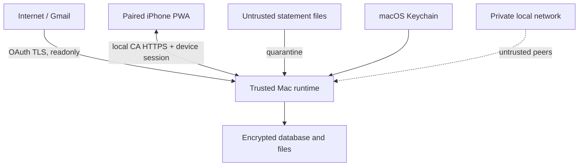

# Security and local operations

## 1. Security objectives

- Keep financial records, statements, and message content under the owner's control.
- Admit only the configured Google identity and explicitly paired devices.
- Protect data at rest, in transit on the LAN, and in backups.
- Make imports and edits attributable and recoverable.
- Avoid turning local parsers or file uploads into code-execution paths.
- Fail closed for writes when integrity or identity is uncertain.

## 2. Trust boundaries



The Mac operating system and owner account are trusted. The LAN, browser input,
Gmail content, SMS content, and uploaded files are untrusted. A paired phone is
authenticated but can still submit malformed or stale data.

## 3. Identity and authentication

- Google OAuth confirms the single allowed email and immutable Google subject.
- The OAuth callback and connection setup occur on the Mac.
- Login is denied if the returned subject/email does not match the configured owner.
- A paired device has a generated key pair, revocable device record, rotating session,
  and optional WebAuthn credential.
- iPhone Face ID is mediated by WebAuthn/passkey APIs; the app never receives biometric data.
- A local PIN fallback is rate-limited and protects session re-entry, not database keys.
- Sensitive operations such as restore, device pairing, key rotation, and raw-source
  export require recent high-assurance authentication.

## 4. Authorization

The initial product has one owner role, but authorization is still enforced server-side.
Capabilities include `ledger.write`, `imports.approve`, `sources.read_raw`,
`devices.manage`, `backups.restore`, and `security.rotate_keys`. This prevents a future
multi-role change from being mixed into accounting handlers and limits paired sessions.

## 5. Secret and key management

Key hierarchy:

1. A random master key is generated during Mac setup and stored in macOS Keychain.
2. HKDF-derived subkeys encrypt the SQLCipher database, attachment objects, browser
   cache envelopes, and backups independently.
3. OAuth refresh tokens and integration secrets are encrypted separately and referenced
   by opaque Keychain identifiers.
4. Device public keys are stored in the database; private keys stay on the device.

Keys never appear in `.env`, source control, logs, QR payloads, or backups in plaintext.
Recovery requires the Mac login plus a user-generated recovery key stored outside the
repository. Key rotation is resumable and verifies each rewritten object before commit.

## 6. Data at rest

- SQLite uses SQLCipher with WAL and secure-delete configuration verified at startup.
- Attachments are individually encrypted with authenticated encryption and content-addressed
  by a keyed hash to avoid leaking equality outside the encrypted index.
- Quarantine and parser temporary files live under an app-private directory, use restrictive
  permissions, and are removed after processing according to retention policy.
- IndexedDB stores only a bounded encrypted cache. The phone cache is erasable and never a backup.
- Full-disk FileVault is strongly recommended as defense in depth, not a substitute for app keys.

## 7. Data in transit

- External Gmail API traffic uses standard TLS and readonly OAuth scope.
- LAN traffic uses HTTPS with a local CA explicitly installed on paired devices.
- Pairing QR includes host and certificate fingerprint but no permanent secret.
- Sessions use secure, HTTP-only, same-site cookies where browser-compatible plus CSRF tokens.
- State-changing endpoints also validate Origin/Host and device binding.
- The API does not enable CORS for arbitrary origins.

## 8. File and parser isolation

- Content sniffing, strict size/page/row/time limits, and archive expansion limits.
- Never execute spreadsheet macros, formulas, PDF actions, JavaScript, or external links.
- Parser worker runs as a separate least-privilege process with no network and no access
  to database/Keychain; it receives one input file and one output pipe/directory.
- Output is schema-validated by the API before persistence.
- Password-protected PDF passwords live only in parser process memory and are redacted
  from errors.
- Keep parser dependencies pinned and scan them before release.

## 9. Web protections

- Strict Content Security Policy with no inline script or remote runtime assets.
- Locally bundle fonts, icons, and chart code.
- Trusted Types where supported; escape all source previews.
- CSRF tokens, clickjacking denial, MIME sniffing denial, restrictive permissions policy.
- Rate limits for login, pairing, PIN, upload, and signed SMS hook.
- Dependency lockfile, integrity checks, and automated vulnerability review.

## 10. Audit model

Audit events record actor/device, timestamp, command, entity, before/after patch, reason,
source correlation, and previous-event hash. The hash chain is tamper-evident, not a claim
of protection against a Mac administrator. Raw secrets and complete source bodies are excluded.

Events are required for:

- login, pairing, revocation, and security changes;
- candidate approval/rejection/merge/split;
- posted transaction reversal/replacement;
- reconciliation and month close/reopen;
- migration and bulk rule actions;
- backup, restore, retention cleanup, and key rotation.

## 11. Backup policy

The user selected Mac-only storage with no external drive. The system therefore keeps
rolling encrypted snapshots on the Mac while clearly warning that theft or total disk
failure can destroy both primary data and backups.

Current operational baseline:

- A timestamped encrypted database snapshot is created and verified before a schema migration.
- A timestamped encrypted database snapshot is created and verified before import parse-result
  replacement, candidate approval, and moving approved/rejected candidates back to pending.
- Automatic snapshots live in `data/backups/automatic`; manual snapshots live in
  `data/backups/manual`.
- Each snapshot has a restrictive-permission manifest containing its filename, size, SHA-256,
  schema version, reason, and timestamps. The manifest never contains the database key.
- The source database must pass SQLite integrity and relationship checks, its WAL is checkpointed,
  and the encrypted copy is reopened with the current key before the snapshot is accepted.
- The current database is never deleted or overwritten by the backup or restore commands.

The current implementation intentionally favors safety over retention automation. Rolling daily,
weekly, and monthly pruning, attachment snapshots, and a visible backup-health indicator remain
future work. Because all copies are on the same Mac, they do not protect against loss of that Mac.

## 12. Startup sequence

1. Acquire a single-instance lock.
2. Read keys from Keychain after owner authorization.
3. Verify directory permissions, certificate validity, database header, and free disk.
4. Open SQLCipher database and run quick integrity checks.
5. Verify migration state; require a verified snapshot before schema migration.
6. Start API, then job runner, then Bonjour advertisement.
7. Run overdue catch-up jobs with bounded concurrency.
8. Surface health and freshness in the app.

## 13. Shutdown sequence

1. Stop accepting pairing, uploads, and new background jobs.
2. Complete or safely checkpoint current transactions/jobs.
3. Flush audit events and sync change feed.
4. Checkpoint SQLite WAL and run lightweight integrity check.
5. Stop parser, API, and Bonjour advertisement.
6. Release the instance lock and clear process memory where practical.

## 14. Recovery runbooks

### Database integrity failure

- immediately switch API to read-only maintenance mode;
- preserve the damaged files and logs;
- verify the latest snapshots newest to oldest;
- stage the selected snapshot into a separate recovery directory;
- inspect `RESTORE_READY.json` and compare database/ledger summaries;
- preserve the active database and activate a staged copy only through a separately reviewed,
  explicit owner operation.

### Local backup and staged recovery

Stop Finance Hero before creating a manual snapshot or staging a recovery copy:

```bash
pnpm stop:local
pnpm backup:local
pnpm verify-backup:local -- /absolute/path/to/snapshot.db
pnpm stage-restore:local -- /absolute/path/to/snapshot.db
```

`verify-backup:local` uses the latest local snapshot when no path is supplied. `stage-restore:local`
creates `data/recovery/restore-<timestamp>-<id>/finance-hero.db` and a `RESTORE_READY.json` receipt.
It does not rename, remove, or replace `data/finance-hero.db`. Activation is deliberately not
automated; it requires an explicit recovery review so a good current database cannot be silently
destroyed.

All encrypted snapshots require the same original database key. If validation reports that the key
cannot unlock a database, do not guess keys, generate a replacement, or paste secrets into logs or
issues. Recover the original `finance-hero.database` / `primary` item from macOS Keychain or verify
another snapshot. A key mismatch and physical database damage can produce similar low-level errors,
so the application reports safe recovery steps without exposing cryptographic details.

### Lost/replaced iPhone

- revoke the device from the Mac;
- invalidate all device sessions and SMS-hook signatures;
- pair the replacement device and create a fresh bounded cache;
- do not attempt to restore canonical data from the old phone.

### Gmail token revoked

- stop scheduled Gmail work without affecting other imports;
- display connection error and last successful sync;
- reauthenticate with readonly scope;
- resume from saved history/date cursor with source-ID deduplication.

### Lost Mac

With Mac-only backups, recovery is possible only from another copy the user chose to
retain. The product must communicate this limitation during setup and in backup health.

## 15. Security release gates

- Threat-model review completed for identity, pairing, import, sync, and backup flows.
- No high-severity dependency findings without accepted mitigation.
- Parser fuzz/hostile fixture suite passes resource limits.
- Authorization tests cover every state-changing and raw-source endpoint.
- Restore drill and key-rotation drill pass on a clean Mac user profile.
- iPhone certificate trust, pairing, Face ID re-entry, and revocation are verified manually.
