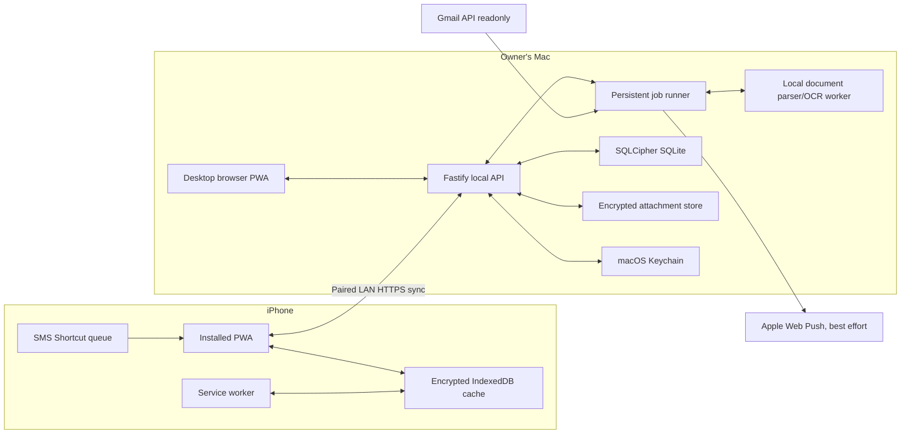
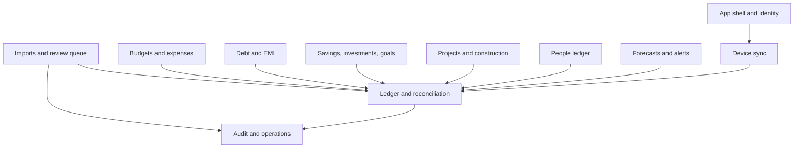

# System architecture

## 1. Architectural style

Finance Hero is a modular monolith running on the owner's Mac, accompanied by an
offline-capable PWA. This keeps deployment and backup simple while preserving clear
module boundaries that can be extracted later if necessary.

The Mac API is the authority for ledger sequence, canonical records, attachments,
imports, schedules, forecasts, and backups. Each browser device owns a limited local
cache and an idempotent mutation outbox.

## 2. Runtime topology

## 3. Proposed stack

| Layer | Choice | Rationale |
| --- | --- | --- |
| Language | TypeScript, strict mode | Shared contracts and one primary language |
| Workspace | pnpm + Turborepo | Fast local monorepo with explicit package boundaries |
| PWA | React + Vite | Small local bundle, direct service-worker control |
| Routing/data | TanStack Router, Query, Table | Typed routes, cache discipline, strong table support |
| Client cache | Dexie over IndexedDB | Transactional offline cache and outbox |
| Charts | Recharts or ECharts adapter | Responsive charts behind a replaceable interface |
| Forms | React Hook Form + Zod | Shared validation and efficient complex forms |
| API | Fastify + Zod/OpenAPI | Low overhead and contract-first validation |
| Domain | Framework-independent TypeScript modules | Testable accounting rules without HTTP or SQL |
| Database | SQLite + SQLCipher + Drizzle | Local, transactional, portable, encrypted storage |
| Job runner | Database-backed internal queue | Survives shutdown and supports catch-up semantics |
| Documents | Python worker: pypdf/pdfplumber, OCRmyPDF/Tesseract, openpyxl | Mature local extraction tools with no data upload |
| Authentication | Google OAuth on Mac; paired device sessions; WebAuthn | Restricted identity plus Face ID-capable re-entry |
| Testing | Vitest + Playwright | Domain, API, migration, sync, and PWA coverage |

An implementation spike must verify SQLCipher bindings and iOS local HTTPS/PWA
installation before feature work. Alternatives require an ADR.

## 4. Module boundaries

Modules communicate through application services and domain events, not direct
cross-module table writes. The domain layer owns classifications and accounting
rules; adapters own Gmail, filesystem, OCR, browser storage, and notifications.

## 5. Layering

1. **Domain**: money, journal transactions, postings, budgets, schedules, goals,
   project commitments, matching, forecasting formulas, and invariants.
2. **Application**: commands and queries such as `ApproveCandidate`,
   `RecordLoanPayment`, `CloseMonth`, and `RunForecast`.
3. **Ports**: repositories, clock, identity, file extraction, message source,
   market valuation, notification, and key storage interfaces.
4. **Adapters**: SQLite, Gmail API, local HTTP, Python parser, IndexedDB, Web Push,
   filesystem, and macOS Keychain.

HTTP handlers and UI components may not implement accounting logic.

## 6. Process model

The Mac distribution launches three supervised processes:

- API/web server;
- background job worker;
- document parser worker started on demand.

For development they run separately; a production launcher starts and stops them
together. Graceful shutdown finishes the current database transaction, records job
state, checkpoints SQLite WAL, and refuses new imports before exit.

## 7. Scheduling without 24x7 operation

Jobs store `nextRunAt`, `lastSuccessfulAt`, and a lease. On startup, the runner:

1. releases stale leases;
2. identifies overdue jobs;
3. coalesces repeatable jobs into one catch-up run;
4. executes in dependency order;
5. calculates the next wall-clock run in `Asia/Kolkata`.

Gmail sync therefore runs at 08:00 every second day when possible, or once at the
next launch. Month-close runs once after the calendar boundary. Idempotency keys
prevent duplicate work after crashes.

## 8. Local network and PWA installation

- Bind the API to the private LAN interface and localhost, never all public interfaces by default.
- Use a stable `.local` hostname advertised with Bonjour/mDNS.
- Create a local certificate authority during setup and install its root certificate
  on the paired iPhone so Safari can use HTTPS and install the PWA.
- Pair using a short-lived QR code shown only on the Mac.
- Firewall rules permit only the private subnet; application sessions remain required.
- Remote access is deferred. A future private overlay network needs a separate ADR.

## 9. Observability

- Structured JSON logs with correlation ID, job ID, import batch ID, and device ID.
- Never log OAuth tokens, statement passwords, full message bodies, or raw attachments.
- Local health view reports database integrity, backup age, parser availability,
  overdue jobs, storage use, sync lag, and last successful Gmail sync.
- Metrics remain local and can be exported as a redacted diagnostics bundle.

## 10. Failure design

| Failure | Expected behavior |
| --- | --- |
| Mac unavailable | PWA reads cache and queues supported edits |
| Network interrupted mid-sync | Retry with same idempotency keys and cursor |
| Gmail revoked | Existing data works; reconnect warning shown |
| Parser failure | Candidate stays failed/retriable; file remains quarantined |
| Candidate duplicated | Matching proposes merge; approval creates one journal entry |
| Database locked/corrupt | Stop writes, surface recovery workflow, preserve evidence |
| Job crashes | Lease expires; retry follows bounded backoff |
| Notification unavailable | Persist in in-app inbox and display on next foreground |

## 11. Quality attributes

- **Correctness** outranks import speed or interface convenience.
- **Privacy** forbids application-cloud storage by default.
- **Recoverability** requires verified backups before destructive migrations.
- **Offline usability** covers viewing, manual capture, and queued edits.
- **Performance targets**: dashboard under 1.5 seconds from warm local cache; ledger
  filter under 300 ms for 100,000 postings; incremental sync under 3 seconds for
  1,000 changes on the local network.
